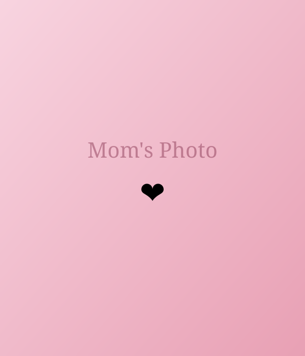

# Customization Guide

How to add your own photos and background music to the birthday site.

---

## Adding Custom Images

All images live in the `assets/` folder. Replace the placeholder SVGs/PNGs with your own photos (`.jpg`, `.png`, or `.webp`).

### Image Reference Table

| File in `index.html` | Used On | Description |
|---|---|---|
| `assets/mom-01.svg` | Page 1, Page 6, Page 8 | Main photo of Mom (circle frame, hero frame, final background) |
| `assets/mom-02.svg` | Page 2 | Left memory photo |
| `assets/mom-03.svg` | Page 2 | Right memory photo |
| `assets/mom-04.svg` | Page 3 | Polaroid labeled "Sunshine" |
| `assets/memory-01.svg` | Page 3 | Polaroid labeled "Home" |
| `assets/memory-02.svg` | Page 3 | Polaroid labeled "A Memory" |
| `assets/family-01.svg` | Page 3 | Polaroid labeled "Always" |
| `assets/flower.png` | Page 5 | Bouquet image |
| `assets/cake.png` | Page 7 | Birthday cake image |
| `assets/bkg1.png` | Odd pages (1,3,5,7) | Background image |
| `assets/bkg2.png` | Even pages (2,4,6,8) | Background image |

### Steps

1. **Prepare your photos** — crop/resize to roughly square or 4:3 for best results.
2. **Name them** to match the filenames above, **or** update the `src` attribute in `index.html`.
3. **Drop them** into the `assets/` folder, replacing the existing files.

### Example: Replacing with your own photos

**Option A — Keep the same filenames:**

Rename your photo to `mom-01.svg` (or `.jpg`/`.png`) and place it in `assets/`. If using a different extension, update the `src` in `index.html`:

```html
<!-- Before -->


<!-- After (using .jpg) -->

```

**Option B — Use your own filenames:**

Place your photo (e.g. `my-photo.jpg`) in `assets/` and update every `src` that references it:

```html

```

### Tips

- **Page 1 circle frame** — a square photo works best since it's displayed in a circle.
- **Page 3 polaroids** — portrait-oriented photos look best in the polaroid frames.
- **Page 5 bouquet** — a transparent PNG looks best (no white background).
- **Page 7 cake** — a transparent PNG looks best.
- **Backgrounds** — use large images (1920×1080 or bigger) for `bkg1.png` and `bkg2.png`.

---

## Adding Background Music

The site has a music toggle button (♪) in the top-right corner.

### Steps

1. **Get an `.mp3` file** of your chosen song.
2. **Create** the `audio/` folder if it doesn't exist:
   ```
   Birthday/
   ├── audio/
   │   └── birthday-music.mp3
   ```
3. **Name the file** `birthday-music.mp3` and place it in the `audio/` folder.
4. That's it — the music button will now play your song.

### Using a different filename

If your file is named differently (e.g. `happy-birthday.mp3`), update line 19 in `index.html`:

```html
<!-- Before -->
<source src="audio/birthday-music.mp3" type="audio/mpeg" />

<!-- After -->
<source src="audio/happy-birthday.mp3" type="audio/mpeg" />
```

### Notes

- Music will **not autoplay** — the user must click the ♪ button to start it.
- The music **loops** automatically.
- Supported formats: `.mp3` (recommended), `.ogg`, `.wav`.

---

## Converting to a Mobile APK (Android)

Since this is a pure HTML/CSS/JS project, you can wrap it in a native Android shell to create an installable `.apk` file. Here are three methods, from easiest to most flexible.

---

### Method 1 — Using PWA Builder (Easiest, No Coding)

1. **Host the site** on any free platform (GitHub Pages, Netlify, Vercel).
2. **Add a `manifest.json`** to the project root:
   ```json
   {
     "name": "Happy Birthday Mom",
     "short_name": "Birthday",
     "start_url": "/",
     "display": "fullscreen",
     "background_color": "#fff5f5",
     "theme_color": "#e8a0b4",
     "icons": [
       {
         "src": "assets/icon-192.png",
         "sizes": "192x192",
         "type": "image/png"
       },
       {
         "src": "assets/icon-512.png",
         "sizes": "512x512",
         "type": "image/png"
       }
     ]
   }
   ```
3. **Add icon images** — create `icon-192.png` (192×192) and `icon-512.png` (512×512) in `assets/`.
4. **Link the manifest** in `index.html` inside `<head>`:
   ```html
   <link rel="manifest" href="manifest.json" />
   ```
5. Go to [PWABuilder.com](https://www.pwabuilder.com/), paste your hosted URL, and click **Build My PWA**.
6. Download the **Android** package — you'll get a ready-to-install `.apk`.

---

### Method 2 — Using Apache Cordova (Command Line)

Requires: **Node.js**, **Java JDK**, **Android SDK**

```bash
# Install Cordova globally
npm install -g cordova

# Create a new Cordova project
cordova create birthday-app com.birthday.mom "Birthday Mom"
cd birthday-app

# Add Android platform
cordova platform add android

# Copy your website files into the www/ folder
# Replace everything in www/ with your project files:
#   index.html, css/, js/, assets/, audio/

# Build the APK
cordova build android
```

The APK will be at:
```
platforms/android/app/build/outputs/apk/debug/app-debug.apk
```

Transfer this file to your phone and install it.

---

### Method 3 — Using Android Studio (Most Control)

1. **Create a new project** in Android Studio → Empty Activity.
2. In `app/src/main/`, create an `assets/` folder.
3. **Copy all your website files** (`index.html`, `css/`, `js/`, `assets/`, `audio/`) into `app/src/main/assets/`.
4. **Replace** `MainActivity.java` (or `.kt`) with a WebView:

   ```java
   import android.os.Bundle;
   import android.webkit.WebSettings;
   import android.webkit.WebView;
   import android.webkit.WebViewClient;
   import androidx.appcompat.app.AppCompatActivity;

   public class MainActivity extends AppCompatActivity {
       @Override
       protected void onCreate(Bundle savedInstanceState) {
           super.onCreate(savedInstanceState);
           WebView webView = new WebView(this);
           setContentView(webView);

           WebSettings settings = webView.getSettings();
           settings.setJavaScriptEnabled(true);
           settings.setDomStorageEnabled(true);
           settings.setMediaPlaybackRequiresUserGesture(false);

           webView.setWebViewClient(new WebViewClient());
           webView.loadUrl("file:///android_asset/index.html");
       }
   }
   ```

5. **Build** → Generate Signed APK (or run on a connected device).

---

### Quick Comparison

| Method | Difficulty | Needs Hosting? | Offline? |
|---|---|---|---|
| PWA Builder | Easy | Yes | Yes (after first load) |
| Cordova | Medium | No | Yes |
| Android Studio | Advanced | No | Yes |

### Tips

- For all methods, make sure **file paths are relative** (no leading `/`). The project already uses relative paths, so it should work out of the box.
- Test on an emulator or real device before sharing.
- To install an APK on a phone, enable **"Install from unknown sources"** in Android settings.
